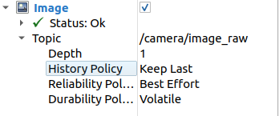

# Camera Lidar Driver

## 系统要求
- Ubuntu 22.04
- ROS 2 Humble
- Livox SDK 2.3.0+

## 依赖安装

### 1. 安装 Livox SDK
```bash
git clone https://github.com/Livox-SDK/Livox-SDK2.git
cd Livox-SDK2
mkdir build
cd build
cmake .. && make -j
sudo make install
```
### 2. 安装 Livox ROS2 Driver
```bash
mkdir -p ~/ws_livox/src
cd ~/ws_livox/src
git clone https://github.com/Livox-SDK/livox_ros2_driver.git
cd ..
colcon build
source install/setup.bash
```

## 注意事项
### 启动指令
```bash
colcon build
source install/setup.bash
ros2 launch sensor sensor.launch.py
```
### qos
在rviz里配置img的
> Depth=1  
> History Policy=Keep Last  
> Reliability Policy=Best Effort  


### 在项目根目录新建camera文件夹放你的mfs文件

标定外参
``` bash
# 录制rosbag
ros2 bag record /camera/image_raw /livox/lidar --output ./middle_1

# 预处理
ros2 run direct_visual_lidar_calibration preprocess calib middle_preprocessed -a \
  --camera_model plumb_bob \
  --camera_intrinsics 4819.40253,4820.07925,2040.75325,1235.20464 \
  --camera_distortion_coeffs 0.00506582,0.10235385,-0.00122684,-0.00035444,-0.11290822

# 粗校准
ros2 run direct_visual_lidar_calibration initial_guess_manual middle_preprocessed/
# 标定
ros2 run direct_visual_lidar_calibration calibrate middle_preprocessed/
# T_camera_lidar 是 lidar2camera ，是雷达项目里所需要的
```